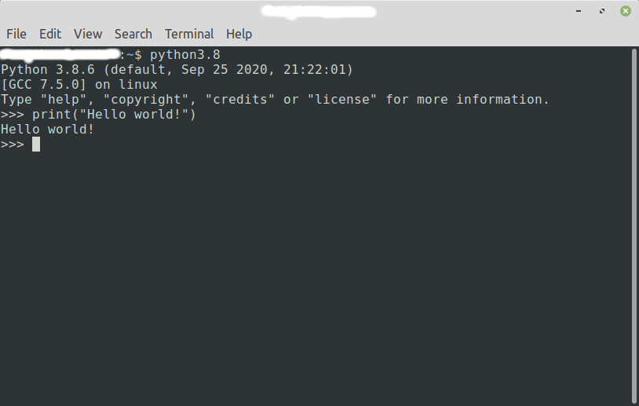

# Початок роботи з Python
Про те як встановити Python та запустити інтерпретатор.

## Встановлення на Windows
Зайди на https://www.python.org/downloads/
Натисни на "Download Python", після цьго на твій комп'ютер буде завантажений файл установки Python.

## Python інтерпретатор в Windows
Для того щоб запустити інтерпретор назми клавішу "win" і напиши "Python".
Запусти програму яку воно знайшло, це і є інтерпретатор.


Вигляд інтерпретатора в Windows.


## Встановлення на Ubuntu
Запусти термінал, це можна зробити за допомогою команди `ctrl+alt+t`.
І виконай наступні команди.
Ці дві команди оновлять система та встановлять необхідні інтрументи для менеджера `apt`.

```
sudo apt update
sudo apt install software-properties-common
```
Ця команда додає репозиторій в якому менеджер `apt` шукатиме програми для встановлення.
```
sudo add-apt-repository ppa:deadsnakes/ppa
```
Знову потрібно виконати оновлення, і другою командою встановити Python.
```
sudo apt update
sudo apt install python3.8
```
## Python інтерпретатор в Ubuntu
Запусти термінал (`ctrl+alt+t`) та введи `python3.8`.
Після цього тобі повинен запуститися інтерпретатор.
Зразок вигляду інтерпретатора, термінал може виглядати по різному в залежності від налаштувань
системи



## Встановлення на Mac
