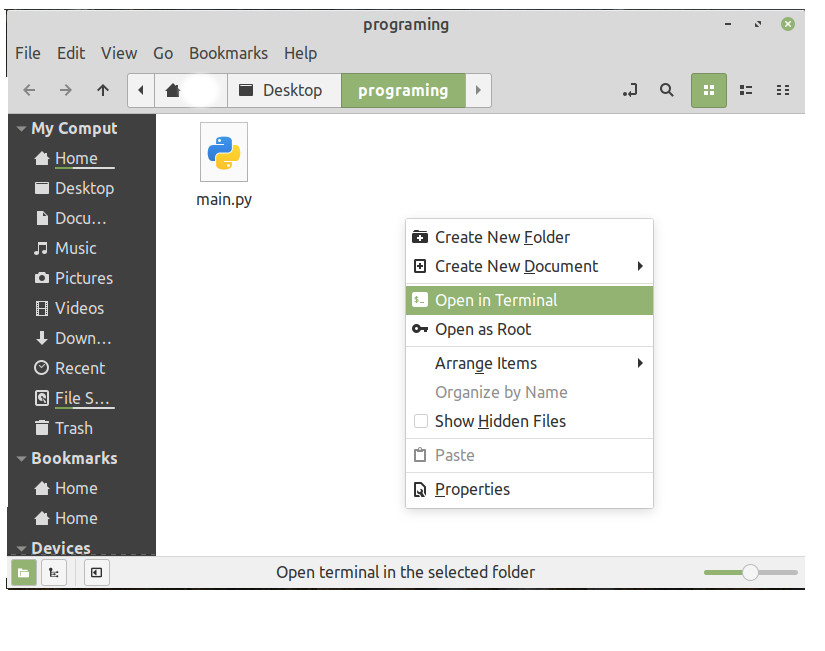

# Запуск Python модулів
Про те як створювати та запускати Python модулі. Для цього тобі потрібно спочатку встановити
Python.
Перед тим як почати створи на робочому столі папку `programing`. В ній ми створимо та запустимо нашу першу програму.

* [Запуск на системі Ubuntu](#Ubuntu)
* [Запуск на системі Windows](#Windows)
* [Запуск на системі MacOS](#MacOS)

## Ubuntu
Створи в папці `programing` файл з назвою`main.py` та запиши в нього наступний вміст.
```python
print("Hello world!")
```

Далі в папці `programing` потрібно відкрити термінал.




Програму можна запустити цією командою `python3.8 main.py`.


## Windows
Створи файл з назвою `main` в папці `programing` та відкрий його в блокноті і запиши наступний вміст:
```python
print("Hello world!")
```
Після цього нам треба збергти цей файл з розширенням `.py`, для цього натисни `ctrl+shift+s`.


Тепер файл з типом "Текстовий документ" можна видалити.


Зараз ми відкриємо командний рядок в папці `programing`, для цього відкрий цю папку, і в рядку шляху заміни `programing` на `cmd` та натисни `Enter`.


Тобі має відкритися командний рядок. Щоб запустити нашу програму виконай команду `python main.py`.

> **_УВАГА:_** При написані або виконанні Python програми твій антивірус може розцінювати програму як вірус.
Це очікувана реакція антивіруса так як Python програми часто використовуються в якості вірусів, і він не може знати чи ти вирішив
вивчити програмування чи на твій комп'ютер потрапив вірус.
В цьому випадку просто дозволь виконати файл.


## MacOS
Перед тим як почати зайди в`Налаштування системи` далі `Клавіатура` і розділ `Клавіатурні скорочення` та переконайся щоб опція `Новий термінал у папці` була включена.
Це дозволить нам відкрити термінал прямо в нашій папці.


Наступним кроком створи на робочому столі папку `programing`. І відкрий її в терміналі


Після цього в терміналі виконай команду `touch main.py`, вона створить файл в якому ми будемо писати код.


Далі відкрий цей файл в текстовому редакторі та запиши туди
```python
print("Hello world!")
```
Тепер назад до терміналу, наступна команда запустить наш файл `python3.8 main.py`


